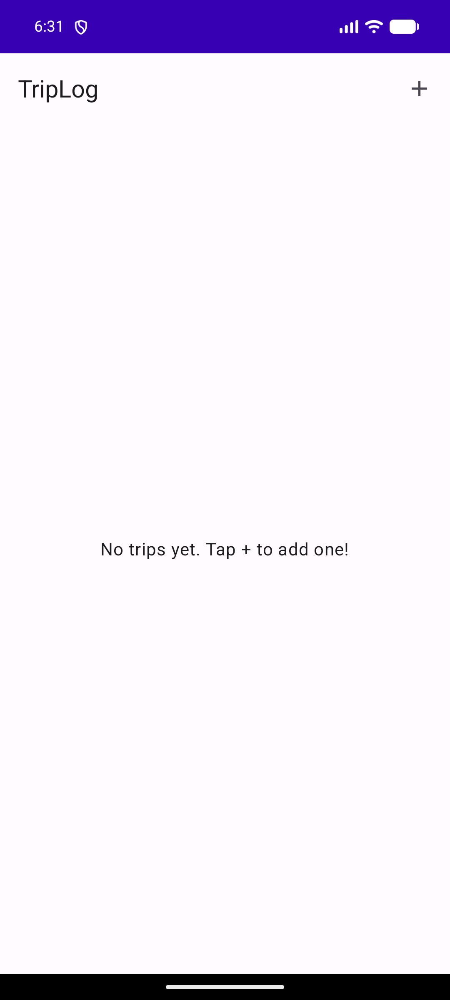
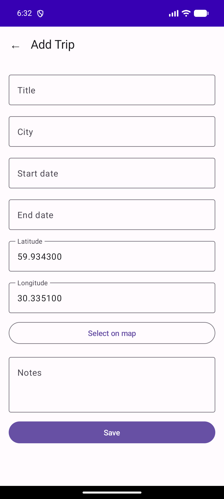
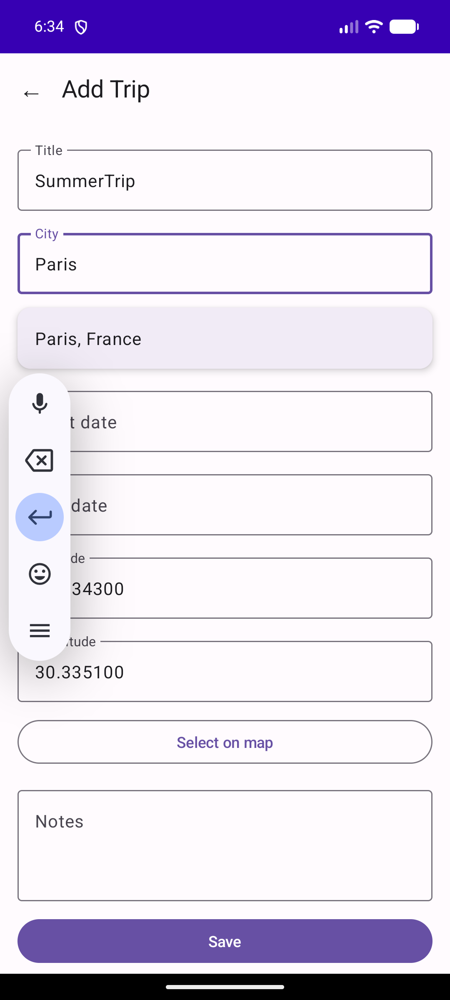
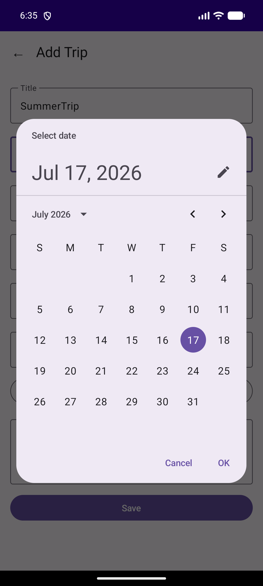
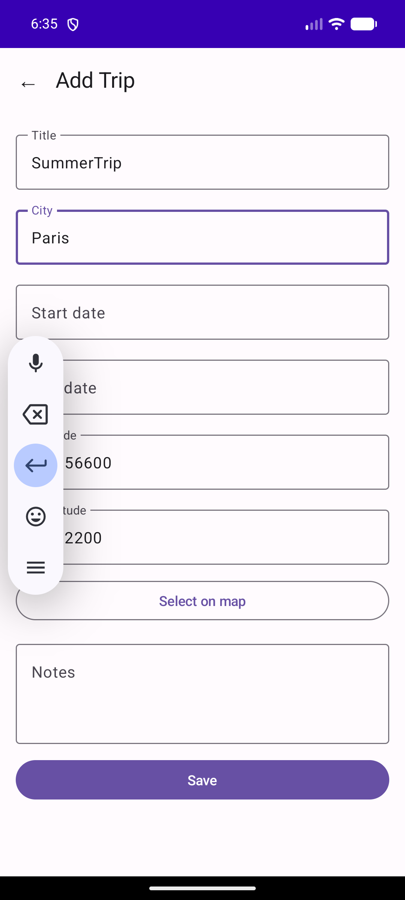
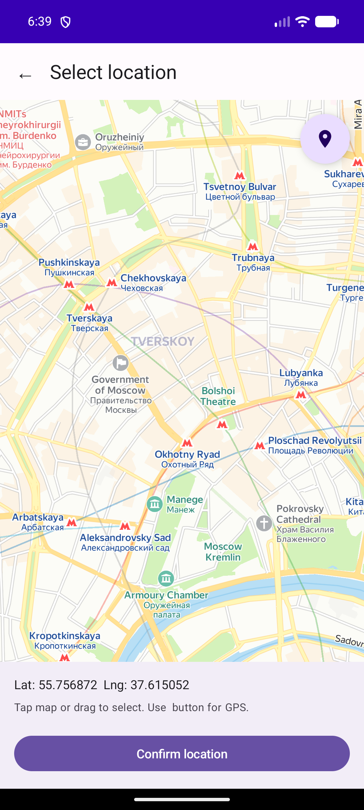
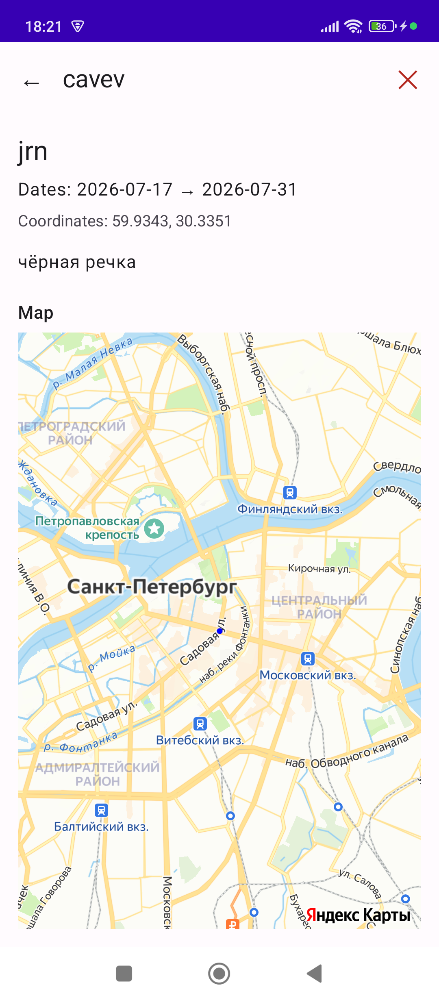

# TripLog

Kotlin Multiplatform (KMP) travel diary app with cross-platform UI on Compose Multiplatform.

## Platforms

| Platform | UI | Database | Maps |
|----------|-----|----------|------|
| Android | Compose Multiplatform | Room (SQLite) | Yandex MapKit + GPS |
| Desktop (JVM) | Compose Multiplatform | SQLite JDBC | Leaflet.js + OSM tiles |

---

## Features

- **Trip CRUD** — create, view, delete trips with title, city, dates, notes, coordinates
- **Date Picker** — Material3 DatePicker dialogs for start/end dates
- **Map Picker** — interactive Yandex MapKit with GPS location, camera listener for coordinate selection
- **GPS Location** — FusedLocationProviderClient for reliable GPS positioning
- **Splash Screen** — AndroidX Core Splash Screen API
- **Last Location Memory** — saves last selected location, restores on next open
- **Delete Confirmation** — AlertDialog before deleting a trip
- **City Picker** — 200+ popular world cities with search, auto-fills lat/lng

---

## Screenshots

| Main Screen | Add Trip | City Picker |
|-------------|----------|-------------|
|  |  |  |

| Date Picker | City Selected | Map Picker |
|-------------|---------------|------------|
|  |  |  |

| Trip Details with Map |
|-----------------------|
|  |

---

## Android

### Stack
- **Kotlin 1.9.22** + **Compose Multiplatform 1.5.12**
- **Room 2.6.1** — reactive ORM for SQLite
- **Yandex MapKit 4.3.0** — interactive map with placemarks and camera listener
- **Google Play Services Location 21.1.0** — FusedLocationProviderClient for GPS

### Architecture

```
androidApp/src/main/kotlin/com/example/triplog/
├── MainActivity.kt              # Splash screen, MapKit init, GPS permissions
```

```
shared/src/androidMain/kotlin/com/example/triplog/
├── TripEntity.kt                # Room @Entity
├── TripDao.kt                   # Room @Dao — insert, delete, select
├── TripDatabase.kt              # RoomDatabase singleton
├── TripRepositoryImpl.kt        # TripRepository: Room → Flow<Trip>
├── TripMapScreen.kt             # actual — Yandex MapView with placemarks
└── MapPickerScreen.kt           # actual — Yandex MapView + GPS + CameraListener
```

### Database (Room)

Table `trips`:

| Field | Type | Description |
|-------|------|-------------|
| `id` | `INTEGER PRIMARY KEY AUTOINCREMENT` | Trip ID |
| `title` | `TEXT` | Title |
| `city` | `TEXT` | City |
| `startDate` | `TEXT` | Start date (YYYY-MM-DD) |
| `endDate` | `TEXT` | End date (YYYY-MM-DD) |
| `notes` | `TEXT` | Notes |
| `lat` | `REAL` | Latitude |
| `lng` | `REAL` | Longitude |

### Maps (Yandex MapKit)

- `TripMapScreen` — Yandex `MapView` with placemarks from lat/lng
- `MapPickerScreen` — interactive map with:
  - CameraListener for position tracking
  - GPS button (FusedLocationProviderClient) for current location
  - Placemark on selected position
- API key stored in `local.properties` → `BuildConfig.MAPKIT_API_KEY`

---

## Desktop (JVM)

### Stack
- **Kotlin 1.9.22** (JVM target) + **Compose Desktop 1.5.12**
- **SQLite JDBC 3.44.1.0** — file-based DB on disk
- **Leaflet.js 1.9.4** — map preview via static OSM tile images

### Architecture

```
desktopApp/src/jvmMain/kotlin/com/example/triplog/
├── Main.kt                     # Entry point, ComposeWindow
└── TripRepositoryImpl.kt       # JDBC: insert, delete, select + StateFlow
```

```
shared/src/desktopMain/kotlin/com/example/triplog/
├── TripMapScreen.kt             # actual — static OSM tile + Canvas markers
└── MapPickerScreen.kt           # actual — OSM tile + lat/lng input + browser button
```

### Database (SQLite JDBC)

DB file: `~/.trip_log/trips.db`

- On startup: `Class.forName("org.sqlite.JDBC")`
- Auto-creates table if not exists
- All connections wrapped in try-with-resources (auto-close)

---

## Shared (KMP)

### Expect/Actual

| expect (commonMain) | actual (androidMain) | actual (desktopMain) |
|---------------------|----------------------|----------------------|
| `TripMapScreen()` | Yandex MapView with placemarks | OSM tile image + Canvas markers |
| `MapPickerScreen()` | Yandex MapView + GPS + CameraListener | OSM tile + lat/lng input |

### Data Model

```kotlin
data class Trip(
    val id: Int = 0,
    val title: String,
    val city: String,
    val startDate: LocalDate,
    val endDate: LocalDate,
    val notes: String,
    val lat: Double,
    val lng: Double
)
```

### Repository

```kotlin
interface TripRepository {
    suspend fun insertTrip(trip: Trip)
    suspend fun deleteTrip(trip: Trip)
    fun getAllTrips(): Flow<List<Trip>>
}
```

### UI

- **Trip List** — `LazyColumn` with `Card` for each trip
- **Trip Details** — title, city, dates, coordinates, notes, map, delete button
- **Add Trip** — form with DatePicker, lat/lng display, map picker button
- **Map Picker** — interactive map for selecting coordinates
- **Settings** — info screen

### Navigation

State-based navigation via `sealed class Screen`:
```
Screen.List → Screen.Detail(index)
Screen.List → Screen.Add → Screen.MapPicker → Screen.Add
Screen.Detail → (delete) → Screen.List
```

---

## Build & Run

### Requirements
- **JDK 17** (both platforms)
- **Android SDK 34** (for Android build)
- **Gradle 8.5** (via wrapper)
- **Yandex MapKit API key** (for Android maps)

### Getting API Key

1. Go to [Yandex Developer Dashboard](https://developer.tech.yandex.ru/services/)
2. Log in or create a Yandex account
3. Click "Connect APIs" → "MapKit Mobile SDK"
4. Fill in project info, select plan, click "Continue"
5. Copy the API key
6. Add to `local.properties`: `MAPKIT_API_KEY=your_key`

### Commands

```bash
# Android APK
./gradlew :androidApp:assembleDebug

# Desktop JAR
./gradlew :desktopApp:jar

# Tests
./gradlew :shared:test

# Full build
./gradlew build
```

### Run

**Android:**
```bash
adb install androidApp/build/outputs/apk/debug/androidApp-debug.apk
adb shell am start -n "com.example.triplog.android/com.example.triplog.MainActivity"
```

**Desktop:**
```bash
./gradlew :desktopApp:run
```

---

## Project Structure

```
triplog/
├── build.gradle.kts              # Root — all plugins
├── settings.gradle.kts           # Modules: shared, androidApp, desktopApp
├── local.properties              # MAPKIT_API_KEY (not in git)
├── shared/
│   ├── build.gradle.kts          # KMP: commonMain, androidMain, desktopMain
│   └── src/
│       ├── commonMain/           # Trip, TripRepository, UI, App, expect
│       ├── commonTest/           # Unit tests (kotlin.test)
│       ├── androidMain/          # Room + Yandex MapKit + GPS
│       └── desktopMain/          # SQLite JDBC + OSM tiles
├── androidApp/
│   ├── build.gradle.kts          # Android app + KSP + Room + MapKit
│   └── src/main/                 # MainActivity, AndroidManifest, resources
└── desktopApp/
    ├── build.gradle.kts          # JVM app + Compose Desktop
    └── src/jvmMain/              # Main.kt + TripRepositoryImpl
```

---

# TripLog (русский)

Kotlin Multiplatform (KMP) приложение-дневник поездок с кроссплатформенным UI на Compose Multiplatform.

## Платформы

| Платформа | UI | БД | Карты |
|-----------|-----|-----|-------|
| Android | Compose Multiplatform | Room (SQLite) | Яндекс MapKit + GPS |
| Desktop (JVM) | Compose Multiplatform | SQLite JDBC | Leaflet.js + OSM тайлы |

---

## Возможности

- **CRUD поездок** — создание, просмотр, удаление поездок с названием, городом, датами, заметками, координатами
- **Выбор дат** — Material3 DatePicker
- **Пикер карты** — интерактивная Яндекс Карта с GPS, CameraListener для выбора координат
- **GPS-позиция** — FusedLocationProviderClient для определения текущей позиции
- **Splash Screen** — AndroidX Core Splash Screen API
- **Запоминание локации** — сохраняет последнюю выбранную позицию
- **Подтверждение удаления** — AlertDialog перед удалением поездки

---

## Android

### Стек
- **Kotlin 1.9.22** + **Compose Multiplatform 1.5.12**
- **Room 2.6.1** — реактивная ORM для SQLite
- **Яндекс MapKit 4.3.0** — интерактивная карта с маркерами и CameraListener
- **Google Play Services Location 21.1.0** — FusedLocationProviderClient для GPS

### Карты (Яндекс MapKit)

- `TripMapScreen` — `MapView` с маркерами по lat/lng
- `MapPickerScreen` — интерактивная карта с:
  - CameraListener для отслеживания позиции
  - Кнопкой GPS для определения текущей позиции
  - Маркером на выбранной точке
- API ключ в `local.properties` → `BuildConfig.MAPKIT_API_KEY`

---

## Desktop (JVM)

### Стек
- **Kotlin 1.9.22** (JVM) + **Compose Desktop 1.5.12**
- **SQLite JDBC 3.44.1.0** — файловая БД на диске
- **Leaflet.js 1.9.4** — превью карты через статические OSM-тайлы

---

## Сборка и запуск

### Требования
- **JDK 17**
- **Android SDK 34**
- **Gradle 8.5** (через wrapper)
- **API ключ Яндекс MapKit** (для карт Android)

### Получение API ключа

1. Перейдите на [Yandex Developer Dashboard](https://developer.tech.yandex.ru/services/)
2. Войдите или создайте аккаунт Яндекс
3. Нажмите «Подключить API» → «MapKit Mobile SDK»
4. Заполните информацию, выберите тариф
5. Скопируйте API ключ
6. Добавьте в `local.properties`: `MAPKIT_API_KEY=ваш_ключ`

### Команды

```bash
# Android APK
./gradlew :androidApp:assembleDebug

# Desktop JAR
./gradlew :desktopApp:jar

# Тесты
./gradlew :shared:test

# Полная сборка
./gradlew build
```

---

## Структура проекта

```
triplog/
├── build.gradle.kts              # Корневой — все плагины
├── settings.gradle.kts           # Модули: shared, androidApp, desktopApp
├── local.properties              # MAPKIT_API_KEY (не в git)
├── shared/
│   ├── build.gradle.kts          # KMP: commonMain, androidMain, desktopMain
│   └── src/
│       ├── commonMain/           # Trip, TripRepository, UI, App, expect
│       ├── commonTest/           # Unit-тесты (kotlin.test)
│       ├── androidMain/          # Room + Яндекс MapKit + GPS
│       └── desktopMain/          # SQLite JDBC + OSM тайлы
├── androidApp/
│   ├── build.gradle.kts          # Android app + KSP + Room + MapKit
│   └── src/main/                 # MainActivity, AndroidManifest, ресурсы
└── desktopApp/
    ├── build.gradle.kts          # JVM app + Compose Desktop
    └── src/jvmMain/              # Main.kt + TripRepositoryImpl
```

---

## Лицензия

MIT
